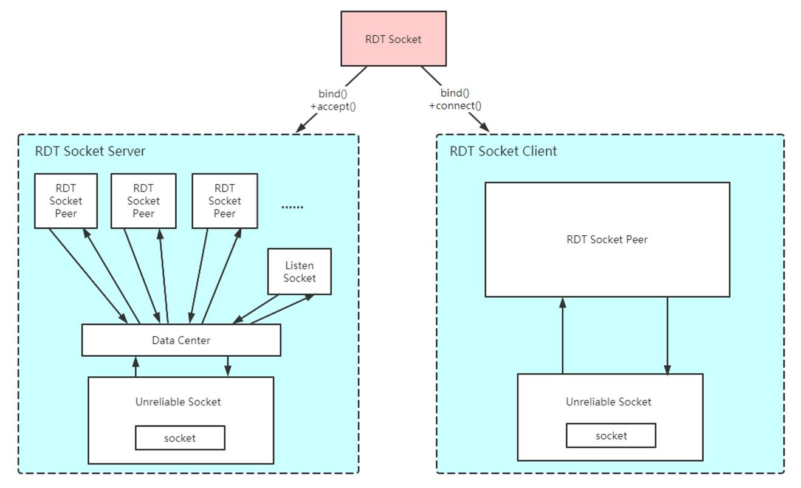
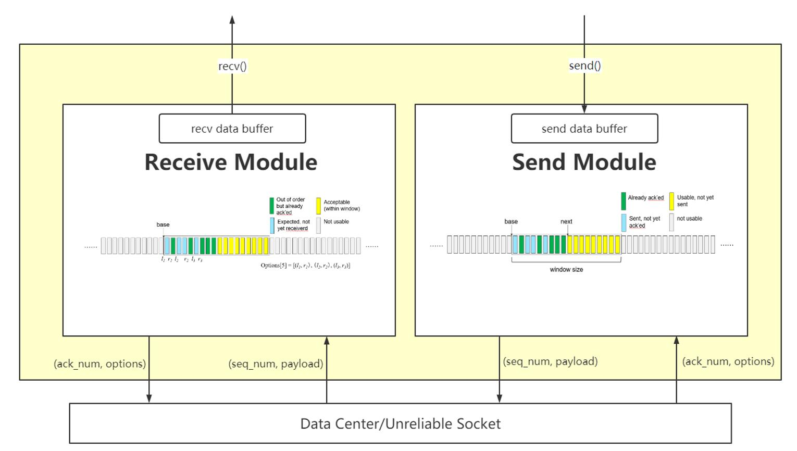
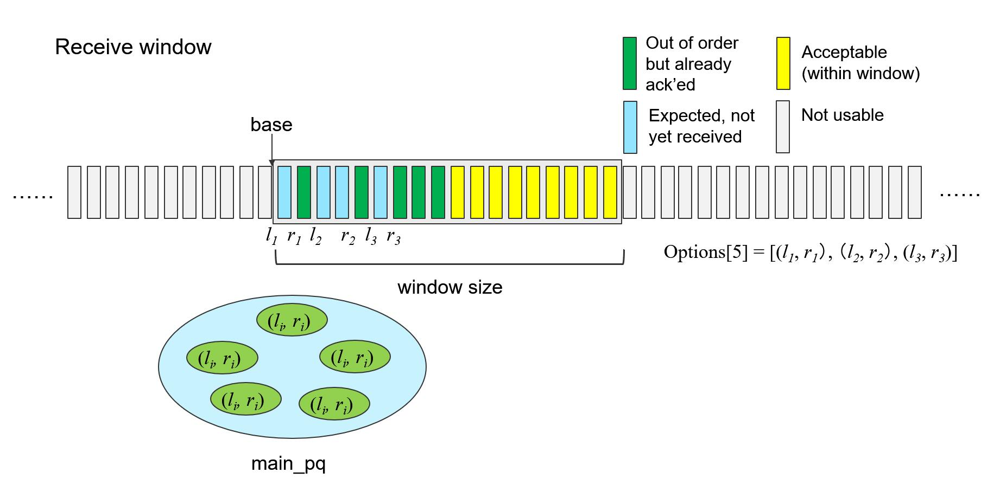
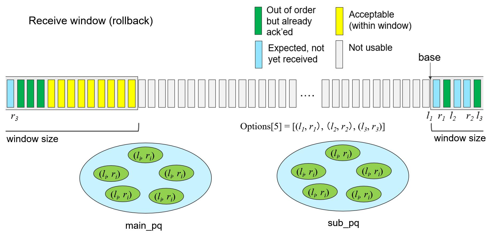

# CS305 Reliable Data Transfer


## Brief
CS305 Computer Network course project in SUSTech 2020-Fall, The description document is at [CS305_Project](./doc/CS305_Project.pdf)

<br>

## Directory tree
```angular2html
.
├── code
│   ├── client.py
│   ├── network.py
│   ├── rdt.py
│   ├── server.py
│   ├── USocket.py
│   └── utils.py
├── doc
│   ├── code_org
│   │   ├── network.py
│   │   ├── rdt.py
│   │   └── USocket.py
│   └── CS305_Project.pdf
├── image
│   ├── RDT_Socket.jpg
│   ├── RDT_Socket_Peer.jpg
│   ├── Receive_Window.jpg
│   └── Receive_Window_rollback.jpg
├── LICENSE
└── README.md
```

<br>


## Quick start

Run the python program code in the directory *./code*, python version recommended 3.6+

<br>

Use default parameters

```bash
python network.py
python server.py
python client.py
```

It is the same as the follow

```bash
python network.py -buf 50000 -loss 0.1 -delay 0 -corrupt 0.00001
python server.py -debug 1
python client.py -file ../LICENSE -debug 1
```

<br>

Note:
* Use multiple clients, please run  *python client.py*  multiple times
*  *network.py*  is used to imitate routers, forward segment
* Parameters: 
  + rate: limit bandwidth, unit Byte/s, default is None, None means no rate limit
  + buf:  router buffer size, unit byte
  + loss: segment loss rate
  + delay: link delay, unit byte/s
  + corrupt: segment corrupt rate
  + debug: debug model, 1 means active, 0 means closed
  + file: file that need to be transferred by the client


<br>

## Technology
* Cumulative Acknowledgement
* Fast retransmission
* Timeout retransmission
* Congestion Control
* Full duplex reliable data transmission
* Multiple clients connect to one server at the same time
* Support one-time transmission of large files (The rollback of seq_num is handled)


<br>

## Design

#### RDT Segment
Format:
```angular2html
      0   1   2   3   4   5   6   7   8   9   a   b   c   d   e   f
    +---+---+---+---+---+---+---+---+---+---+---+---+---+---+---+---+
    |                          Source port #                        |
    +---+---+---+---+---+---+---+---+---+---+---+---+---+---+---+---+
    |                            Dest port #                        |
    +---+---+---+---+---+---+---+---+---+---+---+---+---+---+---+---+
    |                        Sequence number                        |
    |                                                               |
    +---+---+---+---+---+---+---+---+---+---+---+---+---+---+---+---+
    |                     Acknowledgment number                     |
    |                                                               |
    +---+---+---+---+---+---+---+---+---+---+---+---+---+---+---+---+
    | Header length |ACK|RST|SYN|FIN|         Unused                |
    +---+---+---+---+---+---+---+---+---+---+---+---+---+---+---+---+
    |                           Checksum                            |
    +---+---+---+---+---+---+---+---+---+---+---+---+---+---+---+---+
    |                                                               |
    /                            Options                            /
    /                                                               /
    +---+---+---+---+---+---+---+---+---+---+---+---+---+---+---+---+
    |                                                               |
    /                            Payload                            /
    /                                                               /
    +---+---+---+---+---+---+---+---+---+---+---+---+---+---+---+---+

    Flags:
     - HEADER LENGTH             Header length, unit in word 
     - ACK                       Acknowledge
     - RST                       Reset
     - SYN                       Synchronize
     - FIN                       Finish


    Ranges:
     - Source port               0 - 65535
     - Dest port                 0 - 65535
     - Head Length               16 - 60          bytes
     - Sequence Number           0 - 4294967296   bytes
     - Acknowledgement Number    0 - 4294967296   bytes

    Checksum Algorithm:          16 bit one's complement of the one's complement sum
```
ref [RFC 793](https://tools.ietf.org/html/rfc793)

<br>

Options:
```angular2html
Kind: 5
Length: Variable
    
                      +--------+--------+
                      | Kind=5 | Length |
    +--------+--------+--------+--------+
    |      Left Edge of 1st Block       |
    +--------+--------+--------+--------+
    |      Right Edge of 1st Block      |
    +--------+--------+--------+--------+
    |                                   |
    /            . . .                  /
    |                                   |
    +--------+--------+--------+--------+
    |      Left Edge of nth Block       |
    +--------+--------+--------+--------+
    |      Right Edge of nth Block      |
    +--------+--------+--------+--------+

    +--------+
    |        |   1 Byte
    +--------+


    Field:
     - Kind                       Optional types
     - Length                     The length of this option, in bytes
     - Left Edge of nth Block     The left byte range of retransmission requirements
     - Right Edge of nth Block    The right range of bytes of data to be retransmitted

    Block:
     - Maximum number             5

    Function: 
     - Carry the data sequence number range (in bytes) that requires peer retransmission
```
ref [RFC 2883](https://tools.ietf.org/html/rfc2883)

<br>

#### RDT Socket



<div style="text-align: center;">Fig. 1  RDT Socket</div>

<br>



<div style="text-align: center;">Fig. 2  RDT Socket Peer</div>

<br>


> RDT Socket Client
> * Data sending and receiving is realized through the interface provided by USocket.


<br>


> RDT Socket Server
> * RDT socket calls the function listen() to become a server, at this time, a listen socket and a data center will be generated.
> * Data center distribute the data correctly, the data comes from each peer or network, and the destination is the network or the corresponding peer.
> * Listen socket receive the connection request sent by the client. 
> * When the server successfully establishes a connection with a client, a new peer will be generated inside the server to interact with the client. 


<br><br>

#### Peer module

Most of the techniques in RDT Socket Peer module refer to *Kurose, James F., and Keith W. Ross. Computer Networking: A Top-Down Approach. 2007*.

<br>

Receive module use priority queue to 
* Cache the information of received segment(sequence number and data),  sequence num is the key to sorting
* Obtain the range of data sequence numbers that are not received to construct segment filed option 5
* Merge adjacent data in a scattered range of sequence numbers


<div style="text-align: center;">Fig. 4  Receive window</div>


<br><br>

In order to deal with receive window rollback, a sub priority queue is used to temporarily store the segment information.


<div style="text-align: center;">Fig. 4  Receive window (rollback)</div>


<br><br>


## Contributors


<a href="https://github.com/JavuesZhang"> </a><a href="https://github.com/Gan-Cheng"> </a><a href="https://github.com/Ryyyc"> </a>


<br>


## License

[MIT © RDT Team](./LICENSE)